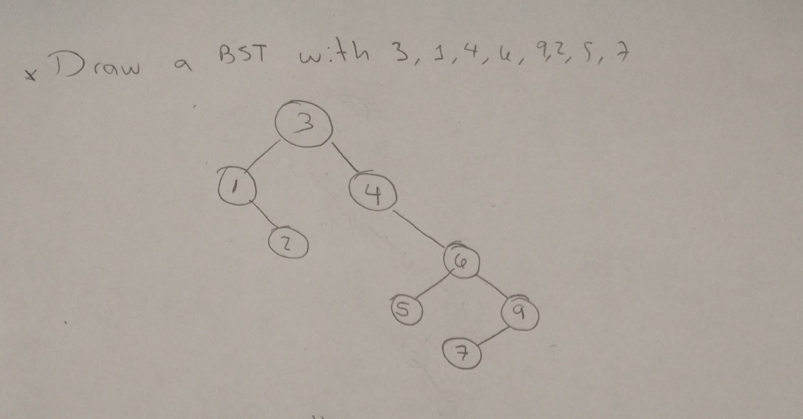
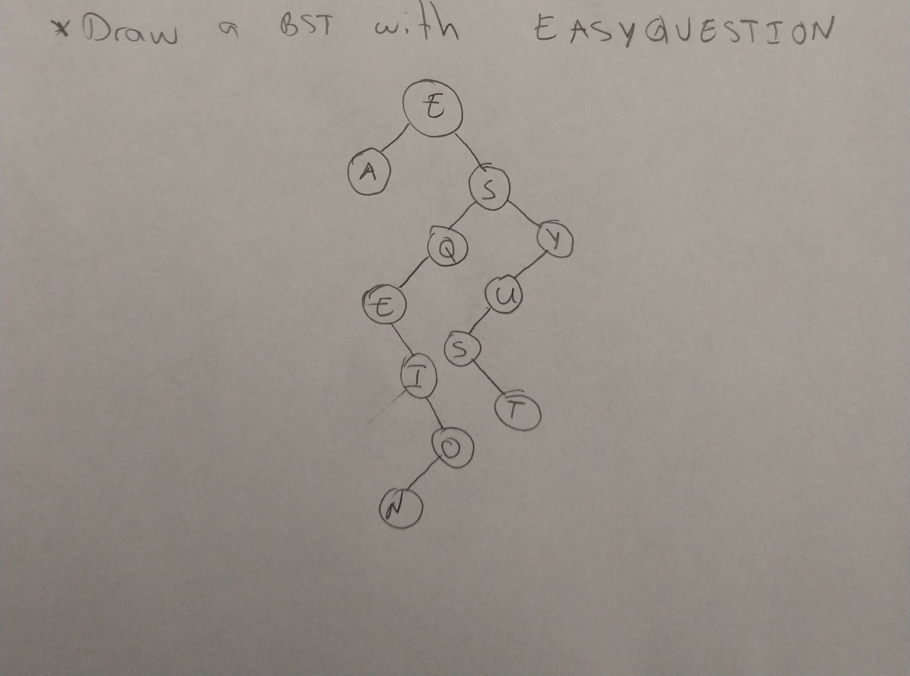
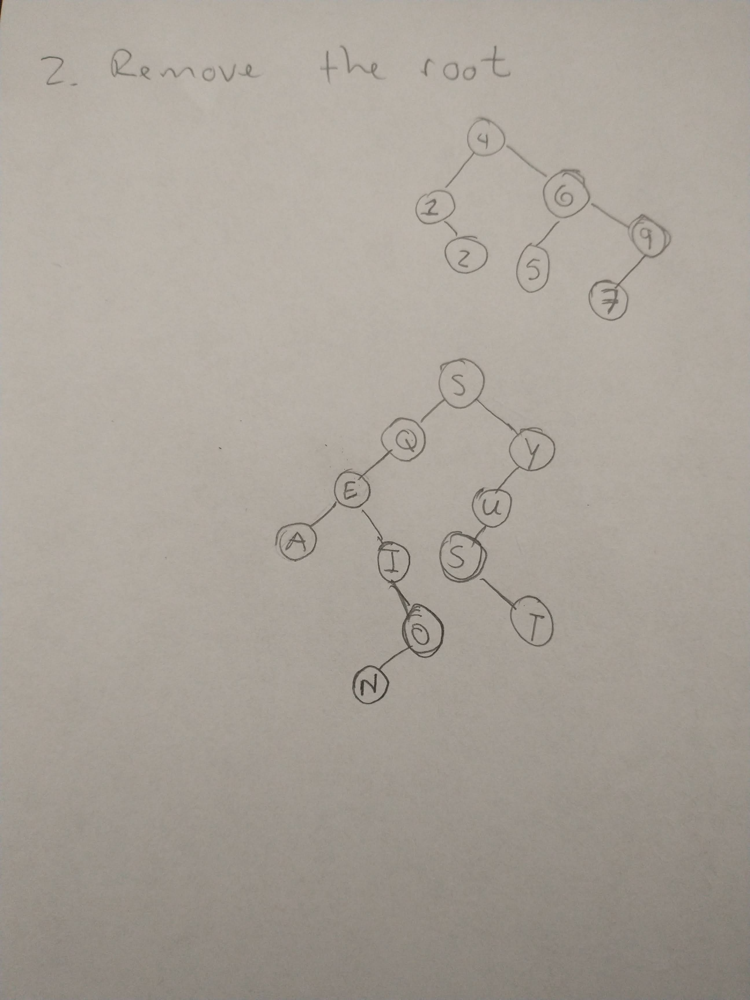

# DSA-BST
Binary Search Trees drills

# Assignment
* Draw a BST
  * Given the data 3,1,4,6,9,2,5,7, if you were to insert this into an empty binary search tree, what would the tree look like? (Draw the tree, no coding needed here.)
  
  * Draw the BST with the keys - E A S Y Q U E S T I O N
  
* Remove the root of the previous trees
  